# Expense Sharing App

This is an expense-sharing application that allows users to track shared expenses, divide them among participants, and generate reports. The application provides a secure way for users to create an account, add expenses, and download balance sheets in PDF format.

## Features

- **User Registration/Login**: Users can create accounts and log in with encrypted credentials.
- **Expense Management**: Add, view, and manage expenses shared among multiple participants.
- **Split Methods**: Split expenses equally, by percentage, or exact amounts.
- **PDF Reports**: Generate and download expense reports in PDF format.
- **Secure Passwords**: User passwords are hashed using `bcryptjs`.

## Technologies Used

- **Backend**: Node.js, Express.js
- **Database**: MongoDB (Mongoose for object data modeling)
- **PDF Generation**: `html-pdf`, `pdfkit`

## Installation

1. Clone the repository:

   ```bash
   git clone https://github.com/your-username/expense-sharing-app.git

2. Navigate to the project directory:

   ```bash
   cd expense-sharing-app

3. Install the dependencies:

   ```bash
   npm install bcryptjs body-parser express html-pdf json2csv mongoose nodemon pdfkit

3. Start the application:

   ```bash
   npx nodemon OR npm start

4. The server will start on http://localhost:5000.

## API Endpoints

### User Routes

- **POST** `/api/users/create`: Create a new user.

  **Request Body**:
  ```json
  {
    "name": "John Doe",
    "email": "john@example.com",
    "mobile": "1234567890",
    "password": "your_password"
  }

- GET /api/users/:userId: Retrieve details of a user by their ID.
 ```text
http://localhost:5000/api/users/6717ca2dc829ac09d41b54ee
```

## Expense Routes

### POST `/api/expenses/add` : Add a new expense.

### Important Considerations for Adding Expenses

1. **User Authentication**:  
   To create a new expense, the **email** and **password** provided in the request must belong to a registered user in the system. Similarly, all participant emails listed in the expense must also be validated as registered users. If any participant's email is not registered, it will be ignored in the expense creation process.

2. **Equal Split Method**:  
   When using the `equal` split method, the system automatically divides the total amount equally among all valid participants. If a specific `share` value is provided for any participant, it will be ignored as it is not considered in this method. The expense is split equally regardless of individual shares.

3. **Exact Split Method**:  
   In the `exact` split method, you must provide the exact share amount for each participant. The total sum of all shares should match the total expense amount. Due to rounding, a discrepancy of up to ₹10 will be accepted by the program to account for minor adjustments during calculation.

4. **Percentage Split Method**:  
   When using the `percentage` split method, the sum of the participants' percentage shares must equal 100%. However, due to rounding, the system allows a minor discrepancy of 1-2%, ensuring the total shares approximately sum to 100%. Any such minor variation will be automatically adjusted during the calculation.


- ## **Split Methods**
**Equal Split**
- This splits the total amount equally among all participants.
```json
{
  "email": "john@example.com",
  "password": "your_password",
  "description": "Dinner with friends",
  "totalAmount": 6000,
  "participants": [
    { "user": "alice@example.com" },
    { "user": "bob@example.com" }
  ],
  "splitMethod": "equal"
}
```
- ## **Exact Split**
- This allows each participant to pay a specific exact amount.
```json
{
  "email": "john@example.com",
  "password": "your_password",
  "description": "Dinner with friends",
  "totalAmount": 6000,
  "participants": [
    { "user": "alice@example.com", "share": 2000 },
    { "user": "bob@example.com", "share": 4000 }
  ],
  "splitMethod": "exact"
}
```
- ## **Percentage Split**
- This splits the total amount based on the percentage share provided for each participant.
```json
{
  "email": "john@example.com",
  "password": "your_password",
  "description": "Dinner with friends",
  "totalAmount": 6000,
  "participants": [
    { "user": "alice@example.com", "share": 40 },
    { "user": "bob@example.com", "share": 60 }
  ],
  "splitMethod": "percentage"
}
```


- **GET** `/api/expenses/user/:userId:` Retrieve the expenses of a particular user by their email. (Also need to add password to gain access)
```text
http://localhost:5000/api/expenses/user/vatsal.private@gmail.com

{
  "password": "Admin@123"
}
```

- **GET** `/api/expenses/all:` Retrieve all expenses across all users.

- **GET** `/api/expenses/download:` Download a PDF balance sheet for all expenses.

## Project Structure
```text
.
├── app.js                  # Main application file
├── routes/
│   ├── userRoutes.js       # User-related routes
│   └── expenseRoutes.js    # Expense-related routes
├── controllers/
│   ├── userController.js   # User logic
│   └── expenseController.js # Expense logic
├── models/
│   ├── User.js             # User model
│   └── Expense.js          # Expense model
├── package.json            # Project metadata and dependencies
└── README.md               # Project documentation

```

## Postman API Setup - Screenshots

<div style="display: flex; flex-wrap: wrap;">

  <div style="flex: 50%; padding: 10px;">
    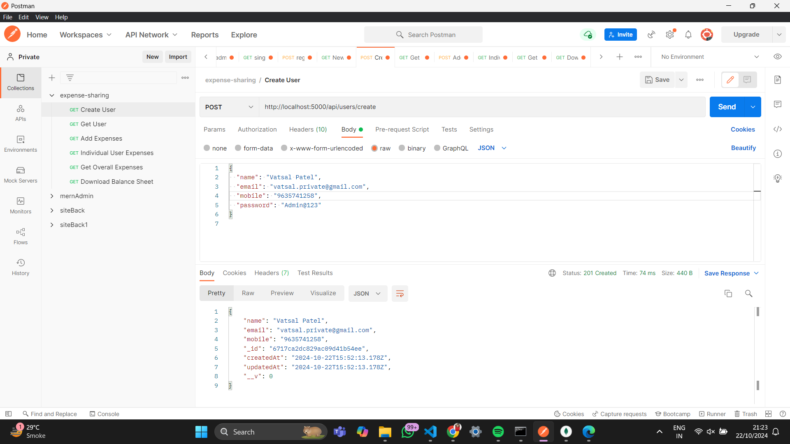
  </div>

  <div style="flex: 50%; padding: 10px;">
    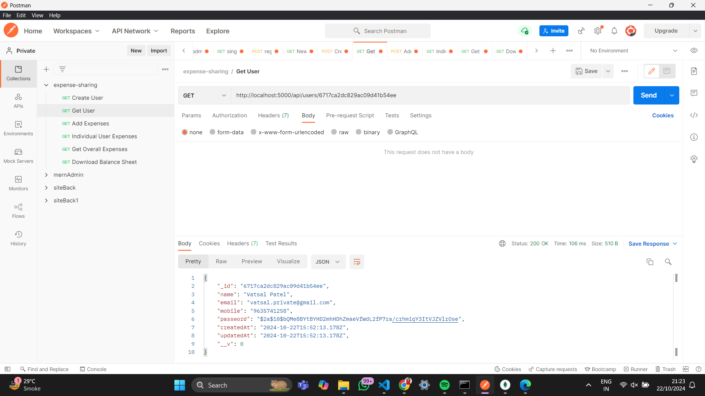
  </div>

  <div style="flex: 50%; padding: 10px;">
    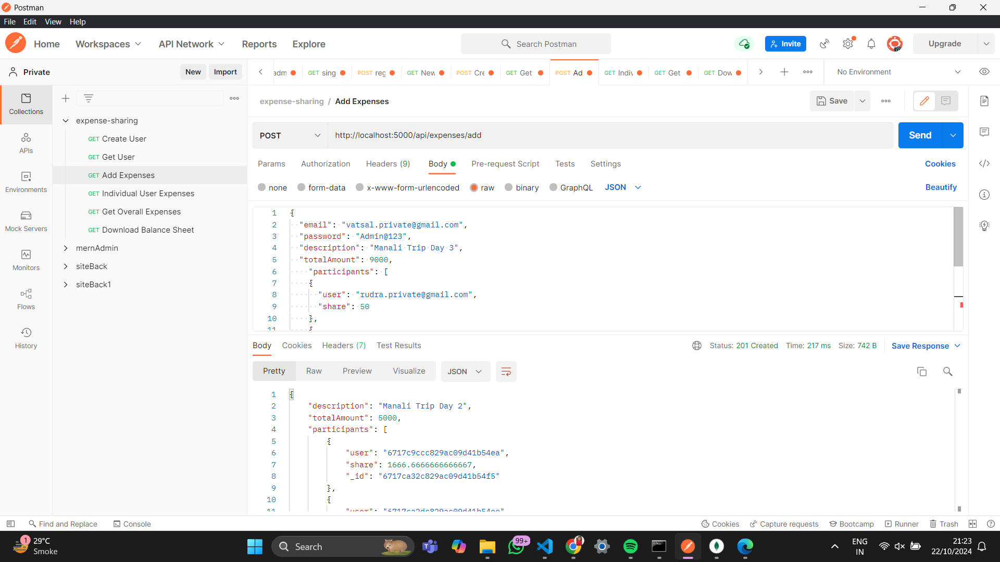
  </div>

  <div style="flex: 50%; padding: 10px;">
    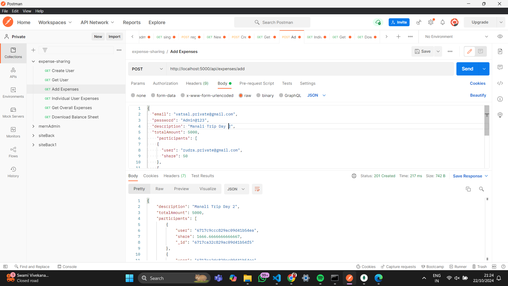
  </div>

  <div style="flex: 50%; padding: 10px;">
    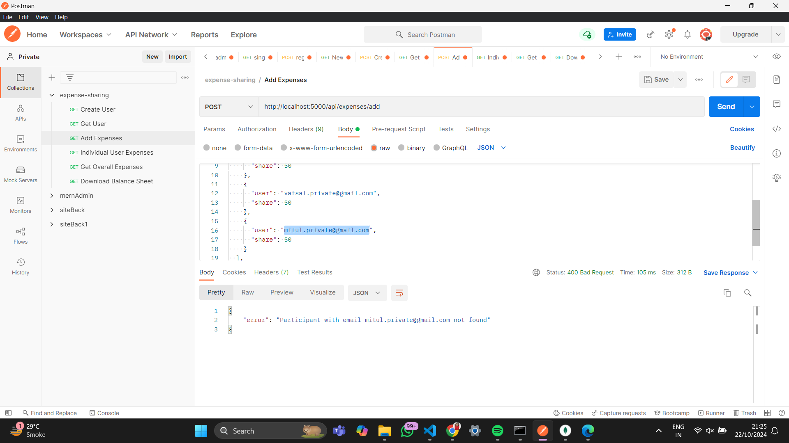
  </div>

  <div style="flex: 50%; padding: 10px;">
    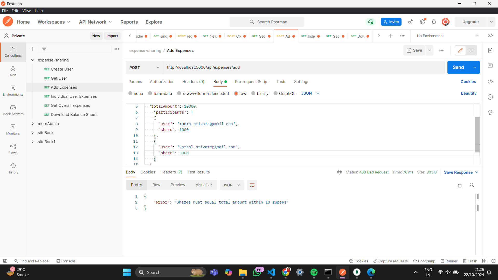
  </div>

  <div style="flex: 50%; padding: 10px;">
    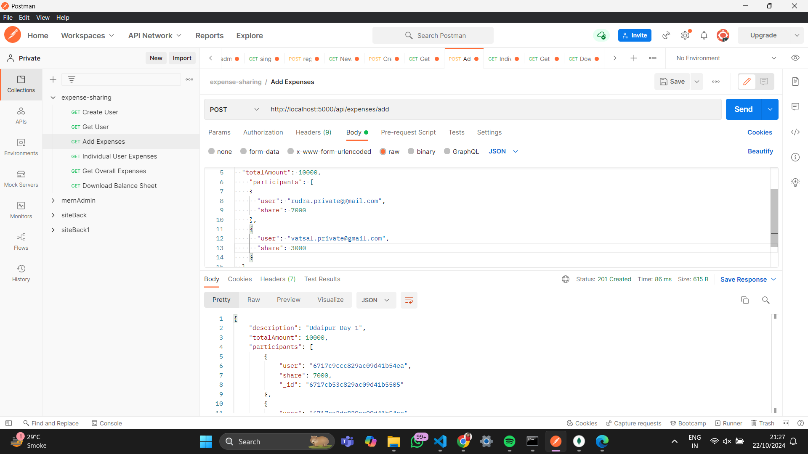
  </div>

  <div style="flex: 50%; padding: 10px;">
    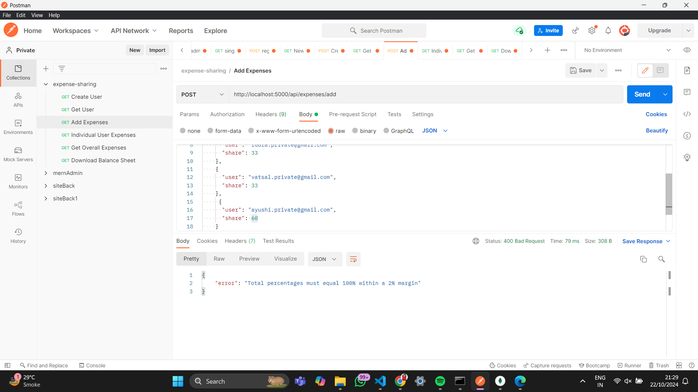
  </div>

  <div style="flex: 50%; padding: 10px;">
    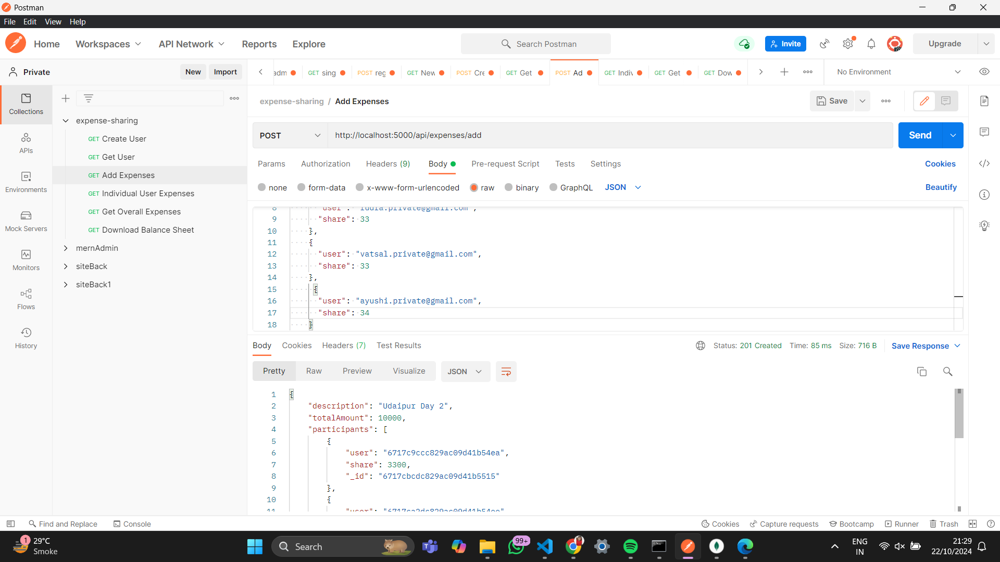
  </div>

  <div style="flex: 50%; padding: 10px;">
    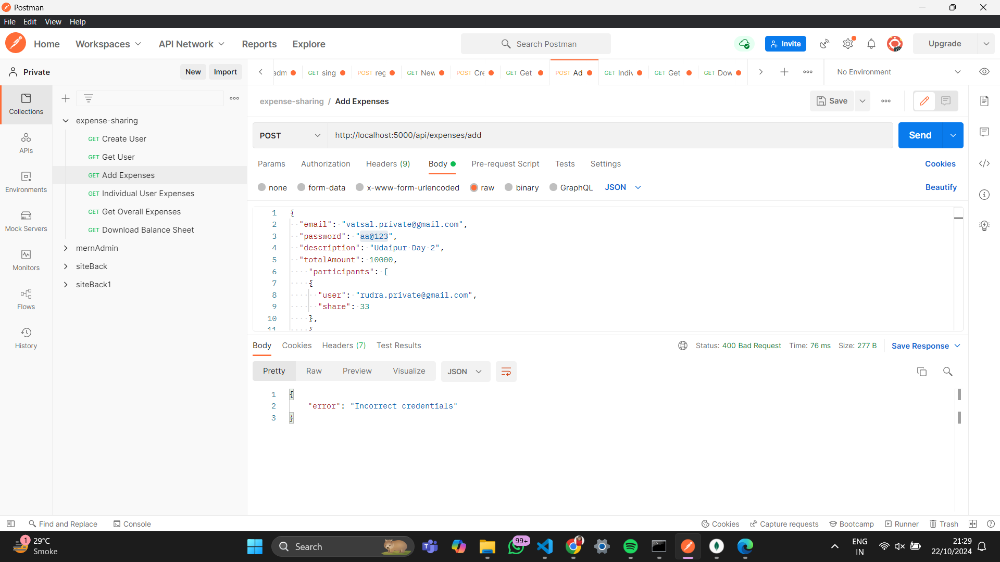
  </div>

  <div style="flex: 50%; padding: 10px;">
    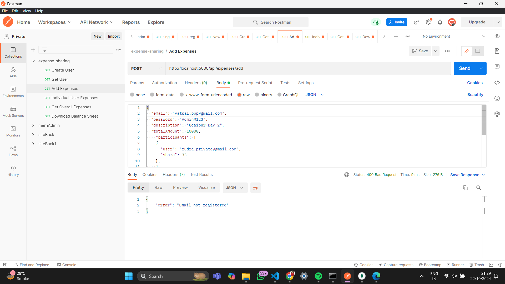
  </div>

  <div style="flex: 50%; padding: 10px;">
    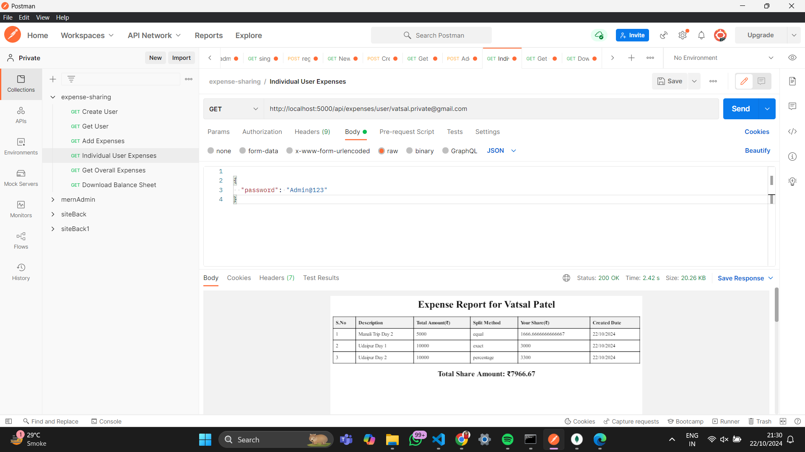
  </div>

  <div style="flex: 50%; padding: 10px;">
    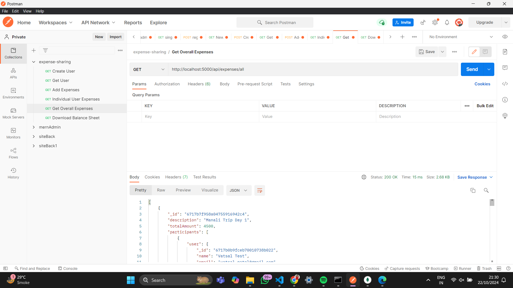
  </div>

  <div style="flex: 50%; padding: 10px;">
    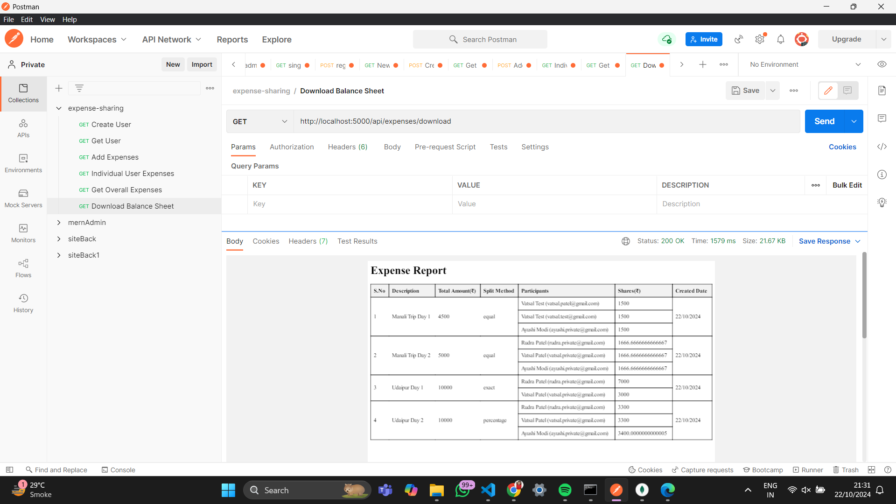
  </div>

</div>

## PDF Sample of Balance Sheet:

- [Download All Balance Sheet (Final)](PDFSample/all_balance_sheet_final.pdf)
- [Download Individual Sheet](PDFSample/individual_vatsal_sheet.pdf)


## Future Enhancements
- **Authentication**: Implement JWT-based authentication for enhanced security.

- **User Dashboard**: Create a front-end dashboard to allow users to visualize their expenses.

- **Notifications**: Send email or SMS notifications when new expenses are added.

- **Debt Settlements**: Introduce a system to track and settle debts between participants.

## Contact
- If you have any questions or suggestions, feel free to reach out:

- Author: Vatsal Patel
- Email: iamvatsallpatell@gmail.com


